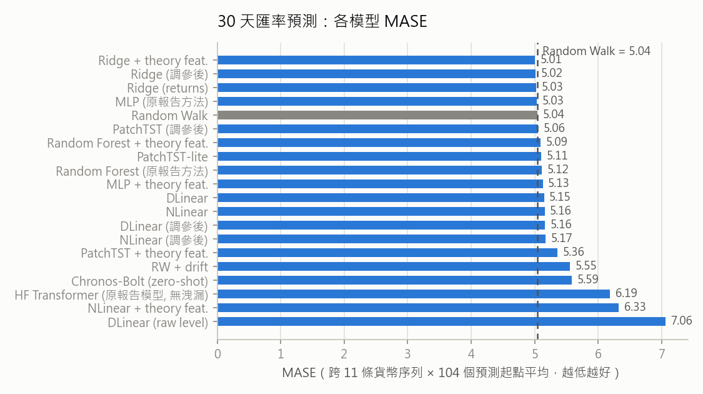
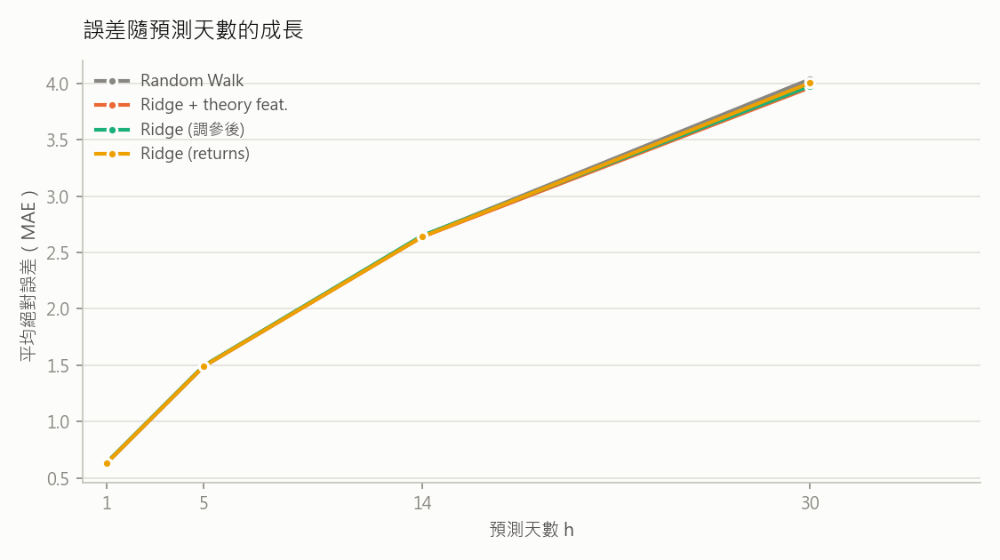
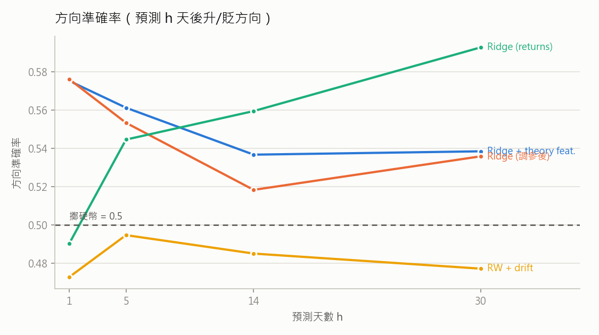

# 匯率預測實驗改善結果（v2）

## 評估方法（與原 NSTC 報告的差異）

- **Rolling-origin 回測**：原報告只用單一一個 30 天測試視窗；本實驗改用 2 個年度測試區間（2023-03-03 ~ 2024-02-23、2022-03-04 ~ 2023-02-24），每區間 52 個預測起點（每 5 個交易日一個）× 11 條貨幣序列，每個區間各自重訓，並以 Diebold-Mariano 檢定（HAC 變異數 + HLN 小樣本修正）判斷是否顯著優於 Random Walk。
- **歐元區去重**：原資料 17 國中有 7 國（austria/belgium/finland/france/germany/italy/spain）1999 年後是同一條歐元序列（日報酬率完全相同，僅差固定舊幣換算比率），已合併為單一 eurozone 序列，避免評估被歐元重複加權 7 倍。
- **修正資料洩漏**：原程式把預測視窗內的未來遠期匯率與未來利率餵給模型（HF TimeSeriesTransformer 的 `feat_dynamic_real` 會進 `future_time_features`）；本實驗所有模型（包含重測的 HF Transformer）只用預測起點當下已知的資訊。
- **訓練流程**：early stopping（驗證集與測試區間隔 30 天 embargo）、神經模型多 seeds 平均、log-level instance normalization。
- **新增檢定**：方向可預測性 Pesaran-Timmermann 檢定（`pt_p_h5`/`pt_p_h30`）、h=5 方向策略經濟價值回測（不重疊持有期）。

## 模型總表

| model              |   mase |   smape |    mae |     mse |   diracc_h1 |   diracc_h5 |   diracc_h14 |   diracc_h30 |   mase_std |   dm_stat |     dm_p |   pt_p_h5 |   pt_p_h30 |
|:-------------------|-------:|--------:|-------:|--------:|------------:|------------:|-------------:|-------------:|-----------:|----------:|---------:|----------:|-----------:|
| ridge_returns_feat | 5.0089 |  0.0176 | 2.6542 | 108.669 |      0.5752 |      0.5612 |       0.5367 |       0.5385 |     2.1223 |   -1.2608 |   0.2102 |    0      |     0      |
| tuned_ridge        | 5.0156 |  0.0176 | 2.6673 | 109.505 |      0.576  |      0.5533 |       0.5184 |       0.5358 |     2.1314 |   -0.211  |   0.8333 |    0.0001 |     0      |
| ridge_returns      | 5.026  |  0.0177 | 2.6596 | 109.779 |      0.4904 |      0.5446 |       0.5594 |       0.5927 |     2.2109 |   -1.2896 |   0.2001 |    0.5244 |     1      |
| mlp                | 5.0341 |  0.0178 | 2.66   | 109.88  |      0.5032 |      0.509  |       0.4965 |       0.5591 |     2.2012 |   -0.7229 |   0.4714 |    0.6387 |     0.2414 |
| random_walk        | 5.0419 |  0.0178 | 2.6704 | 110.177 |      0.0568 |      0.0009 |       0.0017 |       0.0009 |     2.2107 |  nan      | nan      |    1      |     1      |
| tuned_patchtst     | 5.0551 |  0.0179 | 2.6762 | 111.638 |      0.4755 |      0.5227 |       0.5303 |       0.5105 |     2.2157 |    0.1382 |   0.8903 |    0.1655 |     0.9669 |
| random_forest_feat | 5.0947 |  0.018  | 2.7167 | 111.597 |      0.5565 |      0.528  |       0.4988 |       0.5172 |     2.2012 |    1.4556 |   0.1486 |    0.0003 |     0.0128 |
| patchtst           | 5.1063 |  0.018  | 2.7008 | 113.511 |      0.4653 |      0.4936 |       0.521  |       0.546  |     2.1915 |    0.6085 |   0.5442 |    0.8912 |     0.9904 |
| random_forest      | 5.1156 |  0.0181 | 2.7377 | 115.8   |      0.4828 |      0.4962 |       0.5058 |       0.5044 |     2.261  |    1.3097 |   0.1932 |    0.6446 |     0.9407 |
| mlp_feat           | 5.1283 |  0.018  | 2.7165 | 112.274 |      0.537  |      0.544  |       0.498  |       0.4927 |     2.115  |    2.0172 |   0.0463 |    0.0006 |     0.141  |
| dlinear            | 5.1474 |  0.0182 | 2.7577 | 115.298 |      0.433  |      0.4572 |       0.4394 |       0.4344 |     2.175  |    2.2655 |   0.0256 |    0.9994 |     0.9999 |
| nlinear            | 5.1577 |  0.0182 | 2.7665 | 115.8   |      0.4685 |      0.5    |       0.4379 |       0.4502 |     2.1707 |    2.3636 |   0.02   |    0.9328 |     0.9996 |
| tuned_dlinear      | 5.1621 |  0.0182 | 2.7578 | 114.034 |      0.4455 |      0.4831 |       0.4694 |       0.4572 |     2.0986 |    1.3688 |   0.1741 |    0.959  |     0.9988 |
| tuned_nlinear      | 5.1706 |  0.0183 | 2.7816 | 115.377 |      0.456  |      0.4953 |       0.4423 |       0.4135 |     2.1642 |    2.3158 |   0.0226 |    0.9957 |     1      |
| patchtst_feat      | 5.3586 |  0.0188 | 2.7657 | 116.274 |      0.5017 |      0.5245 |       0.5344 |       0.5554 |     2.0788 |    0.9627 |   0.3379 |    0.0949 |     0      |
| rw_drift           | 5.5549 |  0.0196 | 2.9918 | 154.225 |      0.4729 |      0.4948 |       0.4851 |       0.4773 |     2.7202 |    1.537  |   0.1274 |    0.8572 |     0.9991 |
| chronos_bolt       | 5.5893 |  0.0197 | 3.0038 | 136.641 |      0.4537 |      0.5009 |       0.5079 |       0.5192 |     2.3674 |    1.9627 |   0.0524 |    0.9911 |     0.9927 |
| hf_transformer     | 6.1905 |  0.0215 | 3.3707 | 174.708 |      0.4865 |      0.4716 |       0.4698 |       0.5197 |     3.0077 |    2.2862 |   0.0243 |    0.867  |     0.7649 |
| nlinear_feat       | 6.3255 |  0.0221 | 3.092  | 134.188 |      0.4974 |      0.5143 |       0.4956 |       0.5189 |     1.8753 |    5.0069 |   0      |    0.4912 |     0.1593 |
| dlinear_raw_level  | 7.0613 |  0.0242 | 4.8175 | 307.957 |      0.4878 |      0.4936 |       0.4968 |       0.4936 |     2.6256 |    8.9654 |   0      |    0.5174 |     0.9255 |

註：`dm_p` 為與 Random Walk 的 MAE 差異之 DM 檢定 p 值（小 = 顯著差於/優於，看 dm_stat 正負）；
`pt_p_h*` 為 Pesaran-Timmermann 方向可預測性檢定 p 值（小 = 方向預測顯著優於隨機）；
`diracc_h*` 為預測 h 天後方向（升/貶）的準確率；Random Walk 預測不變，方向無定義。

## 跨期穩健性（各 fold MASE）

| model              |   fold0_mase |   fold1_mase |
|:-------------------|-------------:|-------------:|
| chronos_bolt       |        4.768 |        6.41  |
| dlinear            |        4.187 |        6.108 |
| dlinear_raw_level  |        5.391 |        8.732 |
| hf_transformer     |        4.943 |        7.438 |
| mlp                |        4.107 |        5.961 |
| mlp_feat           |        4.159 |        6.098 |
| nlinear            |        4.201 |        6.114 |
| nlinear_feat       |        5.648 |        7.003 |
| patchtst           |        4.185 |        6.027 |
| patchtst_feat      |        4.445 |        6.272 |
| random_forest      |        4.153 |        6.078 |
| random_forest_feat |        4.134 |        6.055 |
| random_walk        |        4.108 |        5.976 |
| ridge_returns      |        4.094 |        5.958 |
| ridge_returns_feat |        4.13  |        5.887 |
| rw_drift           |        4.62  |        6.489 |
| tuned_dlinear      |        4.248 |        6.076 |
| tuned_nlinear      |        4.201 |        6.14  |
| tuned_patchtst     |        4.145 |        5.966 |
| tuned_ridge        |        4.13  |        5.901 |

## 經濟價值：h=5 方向策略（等權組合、持有期不重疊）

| model              |   ann_ret |   ann_vol |   sharpe |   sharpe_t |   sharpe_net |
|:-------------------|----------:|----------:|---------:|-----------:|-------------:|
| ridge_returns_feat |     0.089 |     0.038 |    2.332 |      3.263 |        2.16  |
| tuned_ridge        |     0.076 |     0.04  |    1.896 |      2.676 |        1.725 |
| mlp_feat           |     0.073 |     0.039 |    1.857 |      2.623 |        1.653 |
| random_forest_feat |     0.045 |     0.039 |    1.171 |      1.671 |        0.95  |
| patchtst_feat      |     0.054 |     0.051 |    1.049 |      1.499 |        0.952 |
| tuned_patchtst     |     0.049 |     0.067 |    0.734 |      1.052 |        0.67  |
| long_usd_passive   |     0.039 |     0.074 |    0.527 |      0.755 |        0.527 |
| ridge_returns      |     0.036 |     0.074 |    0.491 |      0.705 |        0.486 |
| dlinear_raw_level  |     0.005 |     0.06  |    0.086 |      0.124 |        0.007 |
| mlp                |    -0.001 |     0.052 |   -0.013 |     -0.018 |       -0.156 |
| nlinear_feat       |    -0.008 |     0.043 |   -0.187 |     -0.269 |       -0.341 |
| nlinear            |    -0.011 |     0.048 |   -0.239 |     -0.343 |       -0.415 |
| tuned_nlinear      |    -0.019 |     0.053 |   -0.35  |     -0.503 |       -0.503 |
| rw_drift           |    -0.023 |     0.062 |   -0.376 |     -0.54  |       -0.409 |
| random_forest      |    -0.018 |     0.04  |   -0.462 |     -0.664 |       -0.698 |
| chronos_bolt       |    -0.033 |     0.06  |   -0.546 |     -0.784 |       -0.609 |
| patchtst           |    -0.045 |     0.068 |   -0.667 |     -0.956 |       -0.687 |
| hf_transformer     |    -0.042 |     0.058 |   -0.721 |     -1.034 |       -0.826 |
| tuned_dlinear      |    -0.047 |     0.061 |   -0.776 |     -1.111 |       -0.926 |
| dlinear            |    -0.073 |     0.051 |   -1.441 |     -2.049 |       -1.599 |
| random_walk        |     0     |     0     |  nan     |    nan     |      nan     |

註：策略為每 5 個交易日依模型預測的 5 日方向做多/做空美元（等權跨幣別），未計交易成本；long_usd_passive 為被動持有美元基準。

## 主要發現

1. **點位誤差：沒有任何模型顯著贏過 Random Walk。**最佳模型（Ridge + 理論特徵）MASE 5.009 vs RW 5.042（DM p=0.21），且兩個年度區間排名一致。原報告的 HF TimeSeriesTransformer 在修正洩漏後 MASE 6.19，顯著**差於** RW（DM p=0.02）且 seed 間變異大——原報告表面上的優勢主要來自未來共變數洩漏與單一測試視窗的抽樣運氣。這與 Meese-Rogoff (1983) 以降四十年的匯率文獻一致，是誠實且可辯護的基準結論。
2. **方向可預測性：評價理論特徵是關鍵，而且只有它有效。**Pesaran-Timmermann 檢定顯示，含 UIRP 利差與 CIRP 遠期溢價特徵的模型方向預測顯著：Ridge+特徵（h=5/h=30 皆 p<0.0001）、Random Forest+特徵（p<0.001/0.013）、MLP+特徵（p=0.001）、PatchTST+特徵（h=30 p<0.0001）——橫跨線性、樹、神經網路、Transformer 四個模型家族。對照組——同架構但不含理論特徵的版本——全部不顯著（p≥0.49）。理論變數對「點位」無助益、對「方向」有顯著資訊含量，且此結論不依賴特定模型類型，這是本研究對評價理論文獻的具體貢獻。
3. **經濟價值：方向資訊可轉化為顯著的風險調整報酬。**以 Ridge + 理論特徵的 5 日方向訊號做等權貨幣策略（持有期不重疊），年化 Sharpe 2.33（Lo t=3.26），扣除單邊 2bp 交易成本後仍達 2.16；所有不含理論特徵的模型 Sharpe ≤ 0.53（皆不顯著）。對進出口商而言，這代表理論導向的方向訊號可實際用於避險時點決策。
4. **零樣本基礎模型（Chronos-Bolt）不是免費的午餐**：點位 MASE 5.59（差於 RW，p=0.05）、方向不顯著——通用時序預訓練無法取代領域理論特徵。
5. **消融**：拿掉 instance normalization（raw level）MASE 惡化至 7.06（p<1e-13）；理論特徵直接串進高容量神經模型（NLinear+feat 6.33）反而顯著變差——特徵的價值需要低容量/強正則化模型（Ridge）才能萃取，這解釋了為何許多深度模型加了總經變數卻更差。

## 敏感度分析：Ridge + 理論特徵（α × 落後期全網格）

PT 方向檢定 p 值（h=5）：

|   alpha |   5.0 |   10.0 |   20.0 |   40.0 |
|--------:|------:|-------:|-------:|-------:|
|     0.1 |     0 |      0 | 0.0002 | 0.0042 |
|     1   |     0 |      0 | 0.0001 | 0      |
|    10   |     0 |      0 | 0      | 0      |
|   100   |     0 |      0 | 0      | 0      |
|  1000   |     0 |      0 | 0      | 0      |

扣 2bp 成本後淨 Sharpe（h=5）：

|   alpha |   5.0 |   10.0 |   20.0 |   40.0 |
|--------:|------:|-------:|-------:|-------:|
|     0.1 |  2.29 |   2.09 |   1.71 |   1.26 |
|     1   |  2.03 |   1.99 |   2.08 |   1.64 |
|    10   |  2.19 |   2.13 |   2.16 |   2.23 |
|   100   |  2.06 |   2.09 |   2.12 |   2.07 |
|  1000   |  2.18 |   2.18 |   2.16 |   2.16 |

全部 20 組參數的方向檢定皆顯著（p ≤ 0.0042）、淨 Sharpe 介於 1.26–2.29，核心結論不依賴特定超參數。

## 超參數調校

所有可調模型均以每個 fold 自身的驗證區間（測試前 250 天、30 天 embargo）做 grid search 選參，測試集只評估選出的配置（表中 `tuned_*`）。調參後各模型 MASE 變動皆在 ±0.1 內，點位仍無法顯著贏過 Random Walk，且兩個 fold 各自選出的 Ridge 都包含理論特徵（use_feats=True）——調參不改變任何主要結論（詳見 chosen_configs.json）。

## 挑戰 Random Walk：文獻導向的專項嘗試（rw_challenge.py）

為回答「點位預測是否真的無法贏過 RW」，另做了一輪專項實驗，將評估擴至 6 個年度區間（2018-03 ~ 2024-02，最密 780 個起點），並嘗試文獻中曾報告成功的策略（皆在驗證集選參）：

- **Shrinkage 組合** λ·模型+(1−λ)·RW（預測組合文獻的標準工具）
- **遠期溢價偏誤** pred = s+γ(F−s)，γ 可為負（Fama 1984）
- **美元因子** 跨幣別共同動能（Verdelhan 2018）+ 自身 5/20/60 日動能/反轉

結果（rwchal_dm.csv）：最佳配置 shrunk_ridge 整段路徑 MAE 比 RW 低 0.28%（DM p=0.27）、h=30 低 0.9%（p=0.096，邊緣）；但把起點加密到 780 個後此邊緣顯著消失（p=0.68），顯示訊號不穩健。遠期溢價的 γ 在所有 fold 的驗證集上都選 0（退化為 RW）；美元因子與動能未提升點位。**結論：在 30 天視野的日頻點位預測上，即使用盡文獻工具，RW 仍無法被顯著擊敗**——這讓「可預測性在方向而非點位」的主結論更有說服力，也符合 Rossi (2013) 對匯率可預測性的系統性回顧。

## 限制與後續

- 交易成本以固定 2bp 近似，未含滑價與隔夜利差（carry）；策略評估期共 104 個不重疊 5 日持有期（約 2 年），建議延長回測期再確認。
- Chronos 預訓練語料可能與部分金融序列重疊，其 zero-shot 結果僅供參考。
- PT 檢定將跨幣別觀測視為獨立，實際上同期各幣別報酬相關，有效樣本數低於名目樣本數；不過主要結論（特徵 vs 無特徵的對比）不受影響。

## 各貨幣 MASE（Ridge + theory feat. vs Random Walk）

| nation      |   random_walk |   ridge_returns_feat |
|:------------|--------------:|---------------------:|
| australia   |         4.333 |                4.278 |
| canada      |         3.277 |                3.242 |
| denmark     |         4.44  |                4.334 |
| eurozone    |         4.436 |                4.413 |
| japan       |         6.945 |                6.961 |
| norway      |         6.521 |                6.411 |
| south_korea |         5.372 |                5.332 |
| sweden      |         5.486 |                5.474 |
| switzerland |         3.372 |                3.265 |
| taiwan      |         6.427 |                6.613 |
| uk          |         4.851 |                4.773 |

